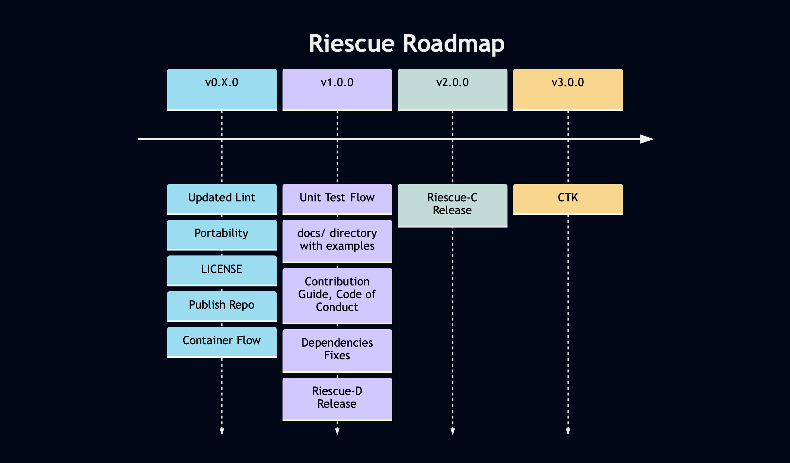

- [RiESCUE](#riescue)
- [Open Source Roadmap](#open-source-roadmap)
- [Installation and Usage](#installation-and-usage)
- [Contributing](#contributing)


# RiESCUE
RISC-V Directed Test Framework and Compliance Suite, RiESCUE

RiESCUE provides a suite of python scripts and libraries for generating RISC-V tests:
* `RiescueD` - RiESCUE Directed Test Framework
* `RiescueC` - RiESCUE Compliance Test Generator 'RiescueC'


### 1. RiescueD - Directed Test Framework
A powerful Python library for writing directed tests in assembly with features like:
- OS code simulation
- Random address generation
- Memory management
- Page table generation
- Support for various privilege modes, paging modes, and virtualization modes

[Learn more about RiescueD](riescue/dtest_framework/README.md)

### 2. RiescueC - Compliance Test Generator
A specialized test generator for RISC-V compliance testing that supports:
- Multiple RISC-V extensions (I, M, A, F, C, D, V, etc.)
- Self-checking test generation
- Configurable test constraints
- Comprehensive extension support

[Learn more about RiescueC](riescue/compliance/README.md)

# Open Source Roadmap
This repository is in the process of being open sourced. The work can be summarized below:



The main milestones for completely open sourcing this repository are to:
- Provide API Documentation for RiescueD
- Open Source the Compliance Suite tools - RiescueC
- Open source the Compliance Test Generation tools - CTK
- Installable python library

# Installation
## From git
To install directly
```
pip install git+git@github.com:tenstorrent/riescue.git#egg=riescue
```

This will install the command line scripts `riescued`, along with making the `riescue` python package available for importing.

## Requirements
### Singularity / Apptainer
This repo currently uses a `singularity` container flow to manage the environment. All dependencies can be found listed in the [Container.def](infra/Container.def) file.

This will be changed in the future to use the python `setuptools` to source python dependencies.

### Toolchains
RiescueD uses the riscv-gnu-toolchain to assemble, compile, and disassemble ELF tests. Toolchain paths can be passed as a command line flag, set as an environment variable, or added to the `PATH`.
- `riscv64-unknown-elf-gcc` is the default executable used for assembling and compiling
  - Searches for a `--compiler_path`, followed by the environment variable `RV_GCC`, then `riscv64-unknown-elf-gcc` in the `PATH`
- `riscv64-unknown-elf-objdump` is the default executable used for disassembling
  - Searches for a `--disassembler_path`, followed by the environment variable `RV_OBJDUMP`, then `riscv64-unknown-elf-objdump` in the `PATH`


### Simulators
Riescue invokes the following Instruction Set Simulators:
- `whisper` [whisper GitHub](https://github.com/tenstorrent/whisper)
  - `whisper` is a git submodule and can be built in the container using `./infra/build_whisper.sh`
  - External whisper binaries can be passed in using the environment variable `WHISPER_PATH` or the command line switch `--whisper_path`
- `spike` [riscv-isa-sim GitHub](https://github.com/riscv-software-src/riscv-isa-sim)
  - `spike` is installed normally in the container flow.
  - External spike binaries can be passed in using the environment variable `SPIKE_PATH` or the command line switch `--spike_path`
Like toolchains, simulators can be set with a command line switch, environment variable, or added to the `PATH`.


# Developing and Contributing
The main dependency needed for developing is singularity or apptainer. See the [Contributing page](.github/CONTRIBUTING.md) for information on setting up a developer environment.
